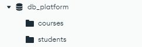
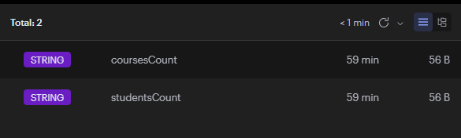
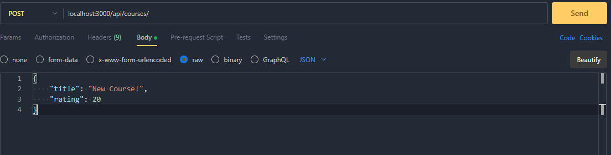
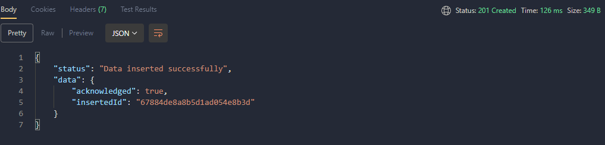
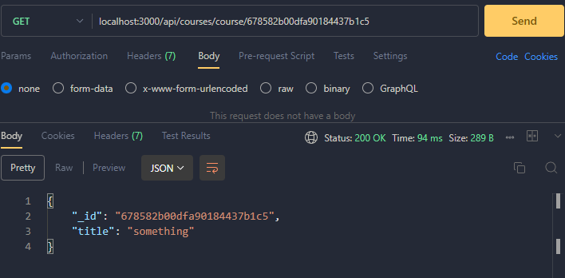
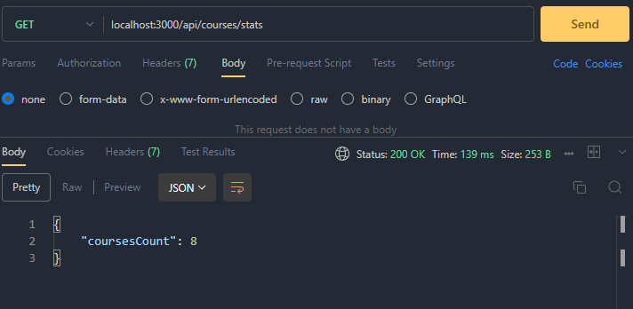
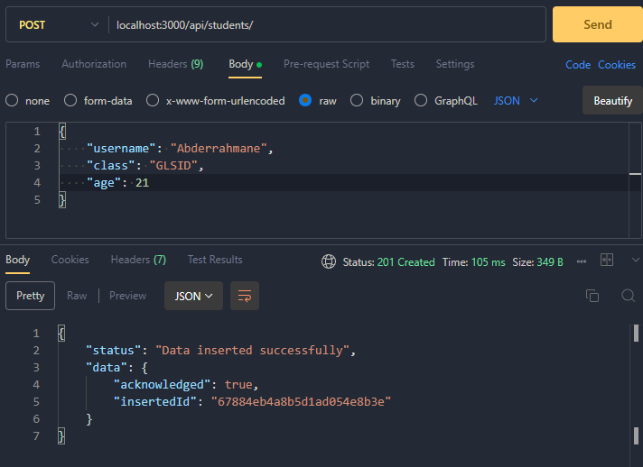
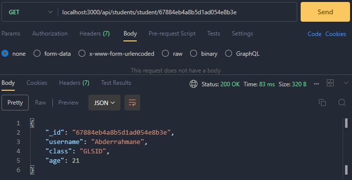
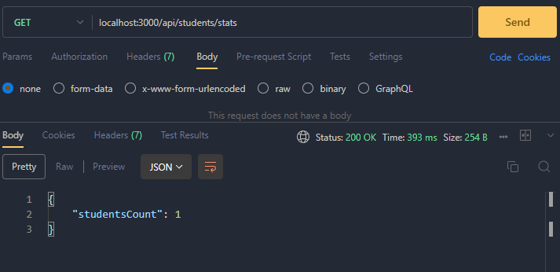

# API de gestion des cours et des étudiants

## Configuration & Installation du projet

Alors pour commencer à utiliser ce projet il faut tout d'abord, télécharger cette répertoire Github. Dans votre invite de commande git, tapez les commandes suivantes:

```bash
git clone <URL-répertoire>
cd learning-platform-template/
```

### Installation des bibliothèques

Après avoir télécharger la répertoire, maintenant il faut installer les différents bibliothèques node.js:

```bash
npm i
```

### Configurer les variables d'environement

Après avoir installer les bibliothèques utilisées, il faut définir les variables d'environement. Dans le fichier `.env.example` vous trouverez l'exemple des variables d'environement. Pour déterminer les variables d'environement, il faut suivre les étapes suivantes:

<ul>
    <li>Dupliquer le fichier et renommer-le sous <code>.env.local</code>.</li>
    <li>Remplacer les valeur des variables par votre propre valeurs.</li>
</ul>

### Exécuter le projet

Afin de faire tout les étapes mentionnées, on peut exécuter notre projet:

```bash
cd learning-platform-template
cd src
node --env-file=../.env.local app.js
```

---

## Choix des technologies

Ce projet représente un API permettant de faire des actions sur deux entités "cours" et "étudiant".

### Pourquoi utiliser MongoDB?

Nous avons choisi MongoDB comme SGBD car il offre une grande flexibilité avec sa structure de données basée sur des documents JSON, ce qui facilite la gestion de données non structurées ou semi-structurées. De plus, il permet une scalabilité horizontale facile, une haute disponibilité grâce à la réplication et un modèle de données performant pour les applications modernes.

### Pourquoi utiliser Redis?

À propos du caching, nous avons utilisé Redis car il est rapide, léger et basé en mémoire, ce qui permet de réduire les temps de réponse en stockant les données fréquemment accédées. Il offre également des fonctionnalités avancées comme la gestion des expirations de clés et la persistance, ce qui le rend idéal pour optimiser les performances et la gestion de sessions.

### Pourquoi utiliser Node.js + express?

Nous avons utilisé Node.js avec Express car Node.js permet un traitement asynchrone efficace, offrant des performances élevées pour les applications en temps réel et à fort trafic. Express, un framework minimaliste et flexible, simplifie la gestion des routes, des middlewares et des requêtes HTTP, tout en permettant de structurer facilement l'application. Ensemble, ils offrent une solution rapide, scalable et performante pour développer des API et des services web.

---

## Annexes

Structure de la base de données


Voici la structure de notre base de données. La BD "db_platform" contient deux collections "courses" et "students", chaque collection contient les documents convenables.

Utilisation de Redis pour faire le caching des valeurs "Stats" où on compte le nombre des cours et le nombre des étudiants


Pour tester notre API on utilise Postman.
Postman est un outil de développement utilisé pour tester et interagir avec des API. Il permet d'envoyer des requêtes HTTP (GET, POST, PUT, DELETE, etc.) vers des serveurs, d'inspecter les réponses, de gérer des environnements et de créer des collections de tests automatisés. Postman est largement utilisé pour le débogage d'API, la documentation et la collaboration entre les équipes de développement.

## Endpoint API

### Les Cours

Ajouter un cours



Afficher un cours


Afficher les statistiques des cours


### Les Étudiants

Ajouter un étudiant


Afficher un étudiant


Afficher les statistiques des étudiants

